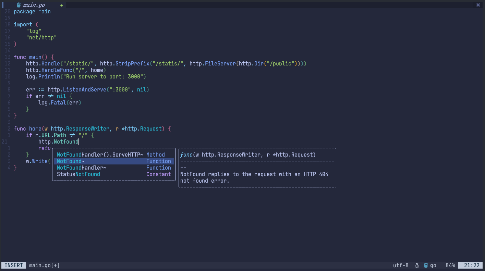

# 🚀 Mi Configuración de Neovim
#### Preview:


Una configuración optimizada para desarrollo con C# y otros lenguajes, diseñada para Windows con énfasis en rendimiento y productividad.


## ✨ Características Principales

- 🎯 **Optimizada para C#**: Configuración específica para proyectos .NET grandes
- ⚡ **Alto rendimiento**: Optimizada para archivos de ~1500 líneas
- 🪟 **Windows-focused**: Configurada específicamente para Windows Terminal
- 🔧 **Plugins esenciales**: Oil.nvim, Telescope, Treesitter

## 📋 Prerrequisitos

### Instalar Scoop (Package Manager para Windows)

```powershell
# Ejecutar en PowerShell como Administrador
Set-ExecutionPolicy RemoteSigned -Scope CurrentUser
irm get.scoop.sh | iex
```

### Instalar Dependencias con Scoop

```powershell
# Instalar ripgrep (búsqueda rápida)
scoop install ripgrep

# Instalar fd (alternativa rápida a find)
scoop install fd

# Instalar Neovim
scoop install neovim

# Instalar Git (si no lo tienes)
scoop install git
```

### Verificar Instalación

```powershell
# Verificar que todo está instalado correctamente
rg --version
fd --version
nvim --version
```

## 📥 Instalación

1. **Clonar el repositorio**

```powershell
# Navegar al directorio de configuración de Neovim
cd ~\AppData\Local

# Clonar este repositorio
git clone https://github.com/TU_USUARIO/TU_REPO.git nvim
```

2. **Abrir Neovim**

```powershell
nvim
```

Los plugins se instalarán automáticamente al abrir Neovim por primera vez.

## 🛠️ Plugins Instalados

### 📂 Navegación de Archivos

- **Oil.nvim**: Explorador de archivos minimalista y rápido
- **Telescope.nvim**: Búsqueda fuzzy finder optimizada

### 🎨 Sintaxis y Lenguajes

- **nvim-treesitter**: Resaltado de sintaxis (C# deshabilitado por rendimiento)
- **nvim-ts-autotag**: Cierre automático de tags HTML/JSX
- **nvim-ts-context-commentstring**: Comentarios contextuales

### 🔧 Utilidades

- **nvim-web-devicons**: Iconos en el explorador de archivos
- **plenary.nvim**: Dependencia para Telescope

## ⌨️ Atajos de Teclado Principales

> **Nota**: `<leader>` está mapeado a la tecla `,`

### Navegación (Oil.nvim)

| Atajo | Acción |
|-------|--------|
| `<leader>fd` | Abrir explorador en directorio padre |
| `<A-d>` | Abrir explorador en directorio actual |
| `-` | Navegar al directorio padre (volver atrás) |
| `<CR>` | Abrir archivo/carpeta |

### Búsqueda (Telescope)

| Atajo | Acción |
|-------|--------|
| `<C-p>` | Buscar archivos (con fd optimizado) |
| `<C-g>` | Búsqueda en contenido (live grep) |
| `<leader>fc` | Buscar solo en archivos C# |
| `<leader>gs` | Estado de Git |

## ⚙️ Configuraciones de Rendimiento

### Optimizaciones para C#

- ✅ Treesitter deshabilitado para archivos C# grandes
- ✅ Límites en búsquedas de Telescope
- ✅ Configuración específica para Windows Terminal

### Archivos Ignorados Automáticamente

La configuración ignora estos directorios/archivos:

```
bin/, obj/, packages/
.vs/, *.dll, *.exe, *.pdb
node_modules/, .git/
```

## 🐛 Solución de Problemas

### Si hay lentitud al abrir archivos C#

```vim
" Verificar estado de plugins
:checkhealth

" Deshabilitar Treesitter temporalmente
:TSBufDisable highlight
```

### Si Telescope no encuentra archivos

```powershell
# Verificar que fd funciona
fd --type f --exclude bin | head -5
```

### Si hay problemas de renderizado

```vim
" Aumentar tiempo de redibujado
:set redrawtime=5000
```

## 📁 Estructura de Configuración

```
~/.config/nvim/
├── init.lua
└── lua/
    ├── plugins/
    │   ├── oil.lua
    │   ├── telescope.lua
    │   └── treesitter.lua
    └── config/
        └── options.lua
```

## 🔄 Actualizar Plugins

```vim
" Actualizar todos los plugins
:Lazy update

" Actualizar Mason LSPs
:MasonUpdate
```

## 💡 Tips de Productividad

1. 🗂️ Usa **Oil** para navegación rápida en proyectos grandes
2. 🔍 `<leader>fc` para buscar solo en C# es más rápido
3. 🚀 Deshabilita Treesitter si trabajas con archivos muy grandes
4. 🪟 Usa Windows Terminal con la configuración optimizada

## 🎯 Próximas Mejoras

- [ ] Configuración LSP para C# (OmniSharp/Roslyn)
- [ ] Debugger integration (DAP)
- [ ] Snippets específicos para C#
- [ ] Más optimizaciones para Windows

## 📝 Notas

> Esta configuración está optimizada específicamente para entornos Windows con proyectos C# grandes. El rendimiento puede variar según el tamaño del proyecto y hardware.

## 🤝 Contribuciones

Las contribuciones son bienvenidas. Por favor, abre un issue primero para discutir los cambios que te gustaría hacer.

## 📄 Licencia

MIT License - siéntete libre de usar esta configuración como base para la tuya.

---

⭐ Si esta configuración te fue útil, considera darle una estrella al repositorio!
